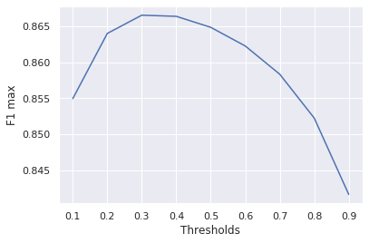
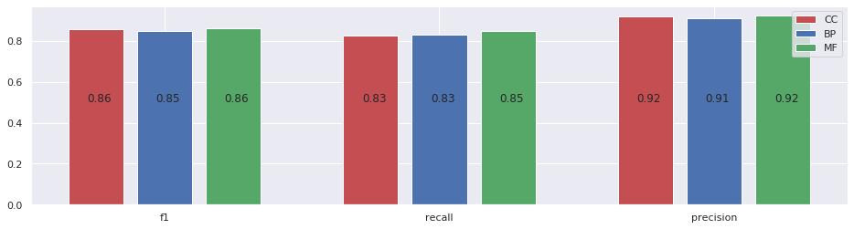
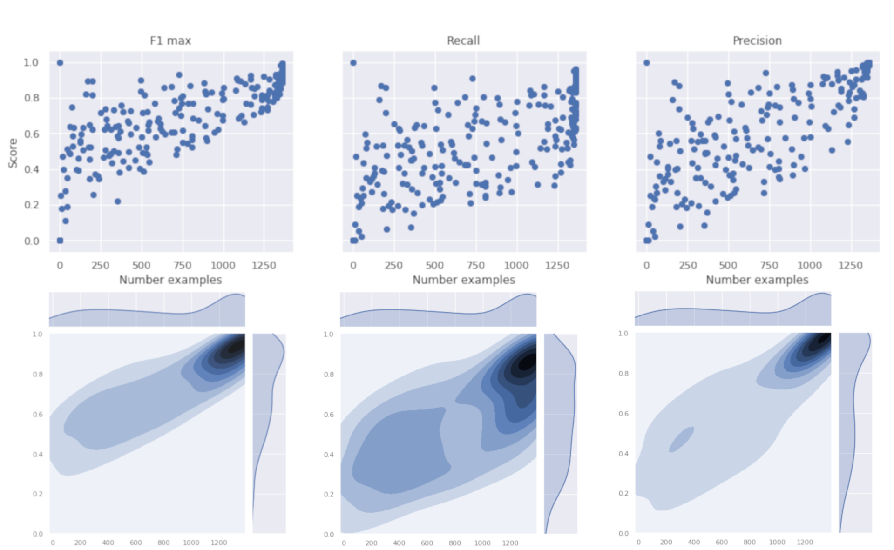

# Protein Function Prediction From Amino Acids Sequence
Proteins are large and complex molecules that play a vital role in almost every function of our body. From contracting muscles to converting food into energy or protecting us from viruses and bacterias. 

Understanding the activity of discovered proteins can help to understand the mechanisms of diseases and guide lab experiments reducing tests, time and costs. At the moment, the most reliable procedure to discover protein's function is through manual experiments. However, this approach can't keep the peace with the technologies used to sequencing proteins. There is a need for reliable and fast automated annotators. 

In this project, I'm going to develop a model that given a new protein in its amino acids sequence form,it can predict its functions. 

- A more detailed project description is available [Here](http://demiledge.com/topicboard/artificialIntelligence/proteinfunc)
- A web application running the deployed model is accessible [Here](https://no-name-app-bio.herokuapp.com/) 

## Getting Started
This project has been developed using python 3.6 and tensorflow 2.0 (beta).
In order to have the project running on your machine you have to:
1. Setup virtual environment and install the dependencies running:
```
python install -r requirements.txt
```
2. Download the UniProtdataset in XML format from [Here](https://www.uniprot.org/uniprot/?query=*&fil=reviewed%3Ayes) and put it inside **extract** folder.
3. Run the script `extract/parsingXML.py` which generates **proteins_goes** and **proteins_seqs** files.

## Project Details
- Run `python main.py --mode=createdata` to generate the TFRecords for training and testing. 
- Run `python main.py --mode=train` to train the model defined in `model/model.py`
- Run `python main.py --mode=evaluate` to test a model stored in `evaluate/models/`
### Extract Folder
Here the script to parse the UniProt dataset in XML format into two files called **proteins_goes** and **proteins_seqs**.
### Prepare Folder
Here the jupyter notebook to analyze the dataset and create the hyperparams to filter the examples in the dataset. While `createDataset.py` generates the TFRecords needed to train the model in tensorflow.
### Evaluate Folder
Here the scripts used to evaluate the model. `custom_metrics.py` defines the metrics used by `evaluator.py` to assess the model's performance. While the jupyter notebook `results_analysis` is used to generate the graphs displayed in **Results** section.

## Results
The model that I come up with it can reliably predict the 1918 most common functions. More precisely, the model achieved a score (protein-centric metric) of F1=0.87, precision=0.84 and recall=0.92 on 140.000 unseen amino acid sequences. In simple words, the method developed predicts 92% of all functions that the protein actually have. At the same time, only 16% of the predicted functions are wrong meaning that the protein doesn't have that function. 

Moreover, the method seems to be robust at the variation of prediction threshold.


With the best performance achieved with a threshold of 0.3. Similar it is the performance when the method is evaluated for each GO class independently.


Finally, to assess how well each GO term is predicted, F1 max, recall, and precision are calculated for each label. Some labels are available only in a few examples, so they have been plotted in relation to the number of times that they appear.  

